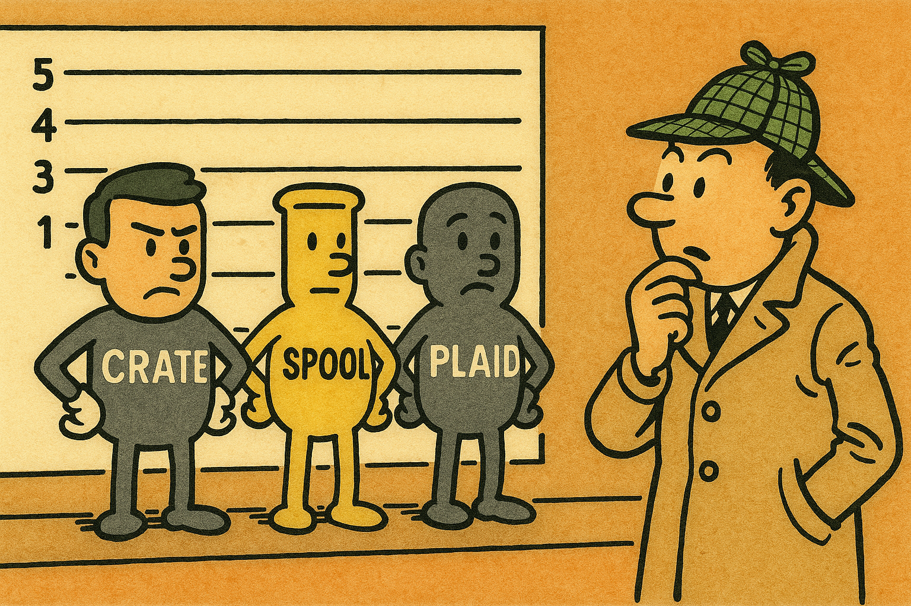

<h1 align="center">

</h1><br>

# Wordle Solver using Trie

This project implements an efficient Wordle assistant to help narrow down possible target words based on feedback from your guesses. It uses a **Trie**-based approach and a filtering logic that leverages a concise description of the feedback received in each attempt.


## :jigsaw: Problem Statement

[Wordle](https://www.nytimes.com/games/wordle/index.html) is a word guessing game where:
- You must guess a hidden word of fixed length `L`.
- For each guess, you receive a **description** consisting of:
  - :green_square: **Green (g)**: Correct letter in the correct position.
  - :yellow_square: **Yellow (y)**: Correct letter in the wrong position.
  - :white_large_square: **Grey (x)**: Letter not in the word at all.

Your task is to efficiently filter a large dictionary of words (`n` total words) and return all valid candidates that match the accumulated description over multiple guesses.

## :blue_book: Terminology

| Term         | Description                                                                 |
|--------------|-----------------------------------------------------------------------------|
| `L`          | Length of each word. All words in the dictionary are of the same length.   |
| `n`          | Number of words in the dictionary.                                          |
| `description`| A mapping derived from feedback (Green, Yellow, Grey) for a given guess.    |

## :receipt: Input Parser Logic (`update_description`)

The `update_description()` function processes the guess and feedback string and updates the internal state (`description`) used for filtering.

Wordle handles **duplicate letters** as follows:
1. First, all **Green** (correct position) matches are processed.
2. Then, **Yellow** matches are considered — **but only up to the remaining count** of that letter in the actual word.
3. Extra instances of letters (duplicates) that do not qualify as Green or Yellow are marked **Grey**.

### :repeat: Three-Pass Parsing Logic:
- **Green Pass**: Fixes the exact letter at a position (`scope[i] = {guess[i]}`).
- **Yellow Pass**: Removes the guessed letter from that specific position but includes it in the "must-be-somewhere" `include` set.
- **Grey Pass**: Eliminates the letter entirely from all positions, **only if it has not already been used for Green or Yellow**.

### Example:

If the guess is `level` and feedback is `xgxyg`, the logic does:
- Green pass: lock `e` at index 1, `l` at index 4.
- Yellow pass: mark `v` as a misplaced but present letter.
- Grey pass: eliminate `l` and `e` from other places, but respects that one `l` and one `e` are already in the correct place.

## :mag: Description Filtering

Once the internal description is updated from feedback, the program uses a **DFS-based filtering** mechanism to search the Trie:

- The `filter()` function initiates a Trie traversal using the current `scope` (allowed letters per position) and `include` set (letters that must appear somewhere).
- Only branches of the Trie that match the constraints are explored.
- A word is only added to the results if:
  - It is a complete word (`isEnd()` is true).
  - It contains **all letters** from the `include` set (i.e., Yellow-marked letters).

This traversal is highly optimized because it prunes entire subtrees based on invalid letters at each position — making the filtering **independent of the total size of the Trie**.

## Input Format
On each iteration, input your guess and the feedback in this format:

```bash
GUESS FEEDBACK
```

###### Example:

```bash
table xgxyx
```

The program will print all matching words that comply with the cumulative description so far.

## :bar_chart: Time and Space Complexity

### :brain: Space Complexity:

- Trie storage: O(n * L) for n words of length L.
- Scope matrix: O(26 * L) worst case, storing all possible letters per position.
- Include set: O(26) (constant space).

**Total**: O(n * L)

### :stopwatch: Time Complexity:
- Insertion of all words: O(n * L)
- Each guess filtering:
    - Uses DFS traversal with early pruning based on scoped letter constraints and the `include` set.
    - The time taken by `filter()` is independent of the total number of words n in the Trie, because it only explores valid branches allowed by the current `description`.
    - **Effective filtering time is proportional to the number of valid candidates, not the size of the full dictionary.**

**Efficient for reasonable dictionary sizes** (n ≈ 10⁴–10⁵).

## :open_file_folder: Dictionary Source

This project uses a word list originally compiled by Donald Knuth for the Stanford Graph Base (SGB), specifically:

- File: [sgb_words.txt](https://people.sc.fsu.edu/~jburkardt/datasets/words/sgb_words.txt)
- [Source](https://people.sc.fsu.edu/~jburkardt/datasets/words/words.html)
- Description: A curated list of 5,757 five-letter words used for algorithmic demonstrations.

## :godmode: Author

This tool was designed to explore one of the most efficient logics for solving Wordle using structured filtering and optimized Trie traversal.

## :page_with_curl: License

This project is released under the MIT License.
